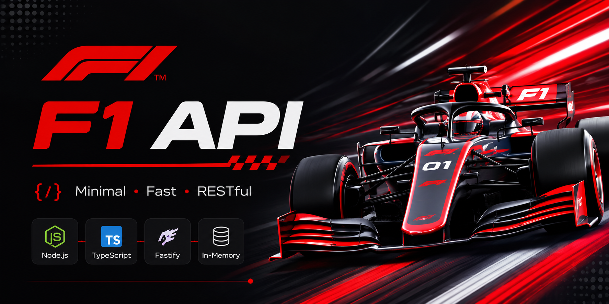

  
  <h1 align="center"><strong>MINIMAL API - F1</strong></h1>
  

	  A minimal API for Formula 1 that provides information about drivers and teams.
  

 

  <!-- Badges -->

  
  [![TypeScript version][ts-badge]][typescript-5-4]
  [![Node.js version][nodejs-badge]][nodejs]

# 🚀 Technologies

This code source was developed with the following items:

### 📦 Dependencies

- [typescript][typescript-npm] - Superset for application scale JavaScript development
- [tsx][tsx-npm] - TypeScript Execute (tsx): Enable Node.js to run TypeScript
- [tsup][tsup-npm] - Bundle your TypeScript library with no config, powered by esbuild
- [@types/node][@types/node-npm] - type definitions for node

### 📄 Files

- `.gitignore` - Ignore folders like node_modules
- `.env` - Enviroment variables
- `tsconfig.json` - Typescript configure Options

### ⚡ Scripts

- `npm run dist`: Compiles TypeScript files to JavaScript in the dist directory.
- `npm run start:dev`: Runs the server in development mode with environment variables loaded from the .env file.
- `npm run start:watch`: Runs the server in development mode with support for automatic reload on file changes.
- `npm run start:dist`: Compiles the project and runs the compiled version from the dist directory.

## Author

| [ Ícaro Ricardo](https://github.com/i529) |
| :---------------------------------------------------------------------------------------------------------------------------------------: |
|                                            [Linkedin](https://www.linkedin.com/in/icaro-ricardo-css/)                                             |

# Credits

icons by [Pino Lamanna][dribble-icon]

[typescript]: https://www.typescriptlang.org/
[typescript-5-4]: https://www.typescriptlang.org/
[ts-badge]: https://img.shields.io/badge/TypeScript-5.4-blue.svg
[nodejs-badge]: https://img.shields.io/badge/Node.js->=%2020.00-blue.svg
[nodejs]: https://nodejs.org/
[dribble-icon]: https://dribbble.com/Schakalwal
[typescript-npm]: https://www.npmjs.com/package/typescript
[tsx-npm]: https://www.npmjs.com/package/tsx
[tsup-npm]: https://www.npmjs.com/package/tsup
[@types/node-npm]: https://www.npmjs.com/package/@types/node
